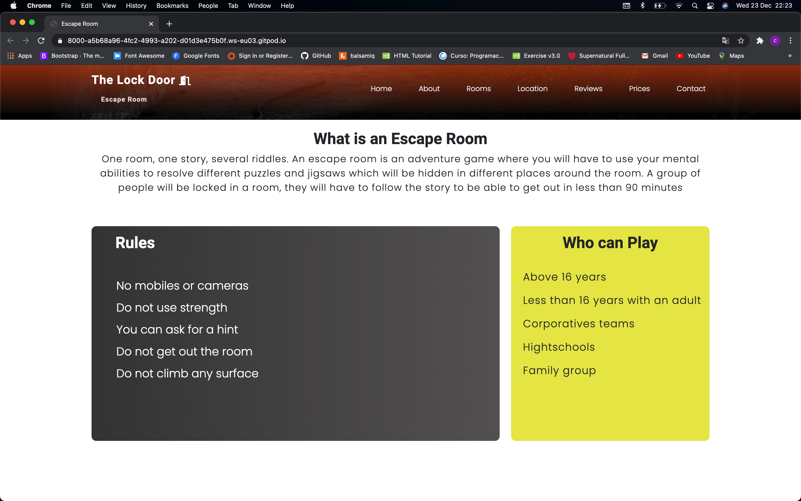
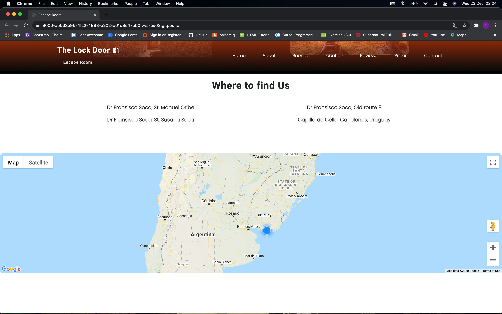
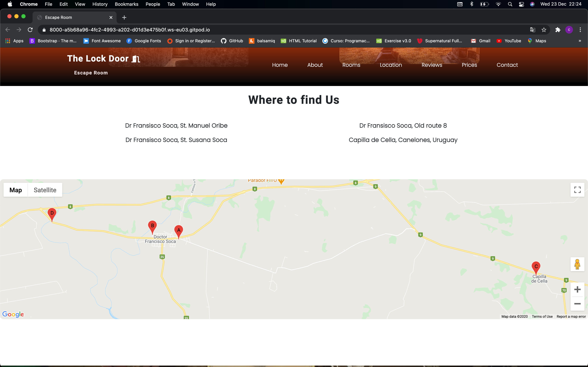
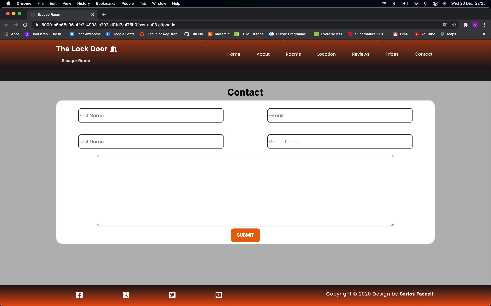

# The Lock Door Escape Room
Would you imagine to be completely lock inside of a roon full of misteries? 
As you can see on this website, **The Lock Door** is a scape room where the people will be able to enjoy and spend their free time having a ball with friends or family. 
Along this website we will bring your services one step closer to your users. Therefore we will put together all the information your users will need in a cool and an attractive website. 
Easy and simple, just with one click you will have on your hand a piece of waht a escape room is. 

## User Experience (UX)

- User Stories

  - As a future player of the game...
       - I want to be able to have a easily navigation experience throughout the website. That means, I want to get as much information as I can get just on a click. I will be looking for prices, where they are based, or which rules I must follow. 
    
       - It will be essential to get a proper description of the services. At the same time I want to have the posibility to get in touch with them just in case I need further information about it. 

       - It will be pretty interesting If as a client I have the oportunity to see reviews and some experiences of other people. I will need to know more than one opinion to trust in the services to be sure It will be an amazing oportunity to have fun. 

    - As the main manger of The lock door..
       - I need an eye catching website to impress the future clients. As much interesting the website is, more people will be joining our games. 

       - I want a simple and unique website where the client will be able to have all the information together without issues. The option to Get in touch with the service will be completely necesary because of the interest we have to give a personal service to the customers.

       - I want to show to the future clients some reviews to let them know how our services are. I want to be able to have a feedback with the players to see how merry they are with the services or which detail we can imrpove for our future clients. Therefore I want to give them the posisbility to check our social media. 

       - I want to provide the information of where our escape rooms are based.
  

  

### Design

  - Color Scheme
    - Main colors used on this project were black, white and an orangered.

  - Typography
    - Fonts used were Poppins as a general font through website and Roboto for headers and sub-headers.

  - Wireframes
    - Desktop devices:

    - Tablet devices: 

    - Mobile devices: 

## Technologies used

  ### Languages Used, Wireframes and programs

- [HTML](https://en.wikipedia.org/wiki/HTML#:~:text=Hypertext%20Markup%20Language%20(HTML)%20is,scripting%20languages%20such%20as%20JavaScript.).
    - Used to create the content of the website.

- [CSS](https://en.wikipedia.org/wiki/CSS).
    - Used to give the attractive design of the website.

- [Javascript](https://en.wikipedia.org/wiki/JavaScript).
    - Used to make the website interactive.

  ### Libraries 
  1. [Bootstrap](https://getbootstrap.com/).
     - Used to create good layout and menu bar.
  2. [FontAwesome](https://fontawesome.com/).
     - Used for the icon on the menu bar when reach mobile devices.
  3. [GoogleFonts](https://fonts.google.com/).
     - Used to choose the fonts of the website.
  4. [jQuery](https://en.wikipedia.org/wiki/JQuery).
     - Used to create a top fixed navbar when scrolling.
  5. [VisualStudioCode](https://code.visualstudio.com/).
     - Create almost all the website on visual studio code.
  6. [Gti](https://git-scm.com/).
     - Used to version control of the project.
  7. [Github](https://github.com/).
     - Used to store the project.
  8. [Balsamiq](https://balsamiq.com/wireframes/?gclid=Cj0KCQiAlZH_BRCgARIsAAZHSBkd367oC7MTQ3JSGyKp4-L14-RIxCOmcc_RS85PwgekpxOu6BzyCFcaAoDvEALw_wcB).
     - Used to create wireframes on desktop, tablet and mobile devices.

## Features
1. Responsive on all devices.

2. Description section by section.

  - As you can see we have navigation bar at the top of the browser with a logo and seven links if you click on them it will bring you to the proper section. Navigation bar will be present through all the website allowing the user to go anywhhere that he wants.
    Below the navbar we have the home section with a huge image an two texts the bigger text will be a catching sentence to bring the attention of the user, the second one will be a small description of what this game is about.
    Also we can see a button which give you the chance to book a ticket for the game.

  - About section constist basically in rules that the users must follow, people who are allowed to play and a description of waht is an escape room.
  As you can see navigation bar still present at the top of the browser.

  - Rooms section is the most important because includes a description of each room. If you hover the mouse over the images it will show you a small description of the rooms.

  - Location section will show to the user where are **The Lock Door** are based. There is for addresses and a map rended bellow the addresses.

  - If you click on it, it will show you all the locations of the places that the game will take place.

  - Reviews section will show to the user, what other players are saying about their experiences, it will give an idea to the user what kind of quality of services **The Lock Door** provide.

  - The user will find a contact form which will ask for basic contact information although this information is necessary otherwise the form won't be submited.

## Testing
Website was checked on W3C markup (html), W3C CSS (CSS) and Syntax Validator Esprima (Javascript) and showed no erros found.

  - [Esprima](https://esprima.org/demo/validate.html)
  - [W3CHTML](https://validator.w3.org/)
  - [WRCCSS](https://jigsaw.w3.org/css-validator/)

### Testing UX Stories.

  1. As a future player...
     - I want to be able to have a easily navigation experience throughout the website. That means, I want to get as much information as I can get just on a click.

         * Once the users get into the website they will find the name of the service **The lock door** with the logo, which will be the first clue to know what they will find along the website. 

         * Since the first moment they will have the posisbility to cheek the navigation bar to go and have a look to the different pages where they will find all the information they are looking for. However they have the posibility to scroll down and see each page one by one.

         * Along each page or section the user will be able to find all the information he will need to know before playing: prices, locations, rules, wich room can suits him better to play... All of this in a simple and easy way without any issues. 

         * The colours and the texts have been selected very carefully to caught the attention of the user. Therefore the hero image is in conection to the information they will find along the site. 

     - It will be essential to get a proper description of the services. At the same time I want to have the posibility to get in touch with them just in case I need further information about it. 

         * As you can check when you are surfing on the website the first thing you will see is the hero image, just beside the picture you have a short text. Thanks to this text the user will know since the first moment what he has to do. Nevertheless once the user press 'About' or scroll down until the next section, he will have the posisbility to read a detailed explanation of what a scape room is, how you can play, wich rules must been followed by the players, and last but not least who is allow to play the game. 

         * The user will find the option to get in touch with the service, when they scroll down until the end of the website or when they press 'contact' on the navigation bar. If you do not fill all the blanks you won't be able to submit your query.
            

     - It will be pretty interesting If as a client I have the oportunity to see reviews and some experiences of other people. I will need to know more than one opinion to trust in the services.

          * The future player will have the option to see what people think about us and our rooms or services. This will be handy for the user as it will help him to make his own conclussions and decisions.
          
  2. As the main manger of The lock door..

        - I need an eye catching website to impress the future clients. As much interesting the website is, more people will be joining our games. 

            - Once you get into the site, you will realise how all the colours, images or texts, have been picked very carefully achieving the goal of catch the attention of the user. All this elemnents are enigmatic with the purpose to be hook up to the website, as a result of this the users will have a new curiosity which bring them to join the play and have some fun with friends and family. 

        
        - I want a simple and unique website where the client will be able to have all the information together without issues. The option to Get in touch with the service will be completely necesary because of the interest we have to give a personal service to the customers.

          - The services we bring to our clients as webdevelopers are unique and individual for each customer so that means the website will be unique as well. 
            
          - As we exlpained before, the website is easy to use, you will have the posibility to press on the different options of the navigation bar, or If it will be easier for you, you just need to scroll down to see each section were you will find the information you will be showing to the future players. 
             
          - As all the information have been puted together along the website. Also you will find what you are asking for; the last section will be the fill which the user must complete to get in touch with your services in the case they have an issue or they just want to know more details about your scape room. 

        - I want to show to the future clients some reviews to let them know how our services are. I want to be able to have a feedback with the players to see how merry they are with the services or which detail we can imrpove for our future clients. Therefore I want to give them the posisbility to check our social media. 

          * One of the options you will find on the navigation bar is 'reviews', so that means the user will be able to see some opinions of your players, it will make the user trust on your servie. 

          * The different incons to get into the social media of the service, will be availabe on the footer of the website. You just need to click on it and It will display a different browser. 

        - I want to provide the information of where our escape rooms are based.

          * The user will have two posibilities to get into the section where the locations are. On one hand they can click on 'location' on the navigation bar. On the other hand they would have the posibiliy to scroll down until find this section.

          * Once the user is in the location section he will find a map where the future player will be able to see the four different locations we have availabe for.

# Credits
  - Images were taken from [PixaBay](https://pixabay.com/).
    - **Hero image** - Image by <a href="https://pixabay.com/users/herm-1025437/?utm_source=link-attribution&amp;utm_medium=referral&amp;utm_campaign=image&amp;utm_content=776297">Herm</a> from <a href="https://pixabay.com/?utm_source=link-attribution&amp;utm_medium=referral&amp;utm_campaign=image&amp;utm_content=776297">Pixabay</a>

    - **Church** - Image by <a href="https://pixabay.com/users/timhill-5727184/?utm_source=link-attribution&amp;utm_medium=referral&amp;utm_campaign=image&amp;utm_content=3790659">Tim Hill</a> from <a href="https://pixabay.com/?utm_source=link-attribution&amp;utm_medium=referral&amp;utm_campaign=image&amp;utm_content=3790659">Pixabay</a>

    - **Cabin** - Image by <a href="https://pixabay.com/users/12019-12019/?utm_source=link-attribution&amp;utm_medium=referral&amp;utm_campaign=image&amp;utm_content=1886620">David Mark</a> from <a href="https://pixabay.com/?utm_source=link-attribution&amp;utm_medium=referral&amp;utm_campaign=image&amp;utm_content=1886620">Pixabay</a>

    - **Room** - Image by <a href="https://pixabay.com/users/vinnyciro-219264/?utm_source=link-attribution&amp;utm_medium=referral&amp;utm_campaign=image&amp;utm_content=581073">Vincent Ciro</a> from <a href="https://pixabay.com/?utm_source=link-attribution&amp;utm_medium=referral&amp;utm_campaign=image&amp;utm_content=581073">Pixabay</a>

    - **Old House** - Image by <a href="https://pixabay.com/users/herbert2512-2929941/?utm_source=link-attribution&amp;utm_medium=referral&amp;utm_campaign=image&amp;utm_content=2759275">Herbert Aust</a> from <a href="https://pixabay.com/?utm_source=link-attribution&amp;utm_medium=referral&amp;utm_campaign=image&amp;utm_content=2759275">Pixabay</a>

    - **Reviews bg** - Image by <a href="https://pixabay.com/users/clockedindk-1934179/?utm_source=link-attribution&amp;utm_medium=referral&amp;utm_campaign=image&amp;utm_content=1155620">Clockedin dk</a> from <a href="https://pixabay.com/?utm_source=link-attribution&amp;utm_medium=referral&amp;utm_campaign=image&amp;utm_content=1155620">Pixabay</a>
